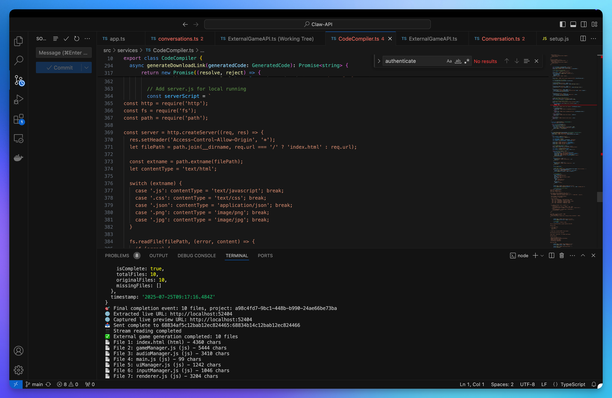
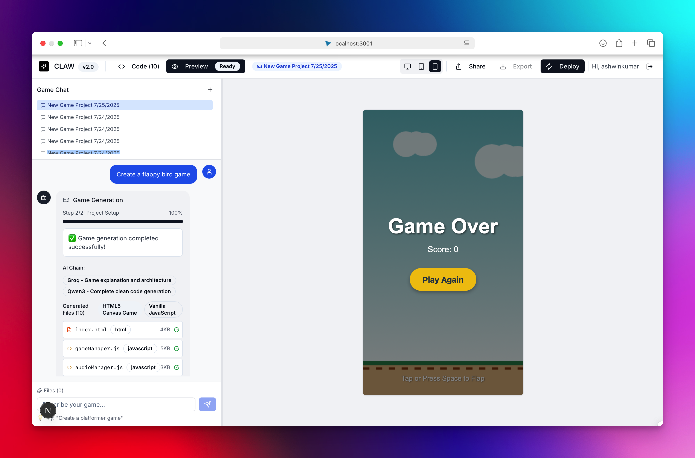
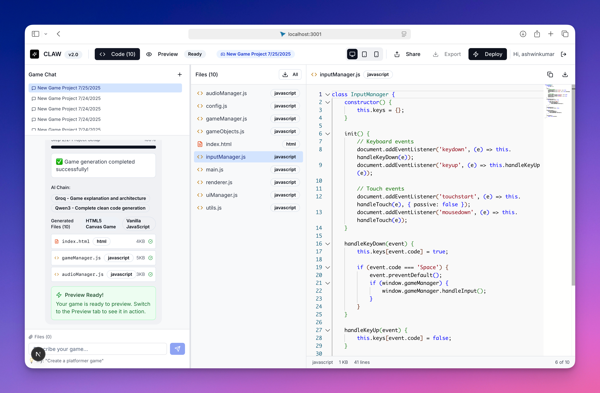

# 🐾 CLAW Code

**CLAW Code** is an AI-native, developer-first platform designed to supercharge 2D and 3D game development with **Unity** as the primary engine, **Gwen** as the customizable in-game UI toolkit, and **Groq**-powered large language models for real-time code generation and backend logic support.

CLAW empowers game developers to generate, preview, and iterate on gameplay mechanics, UI flows, and backend logic — all with natural language prompts and live coding assistance.



## 🧭 Overview

CLAW Code accelerates end-to-end game development by combining a high-performance LLM backend with Unity’s ecosystem and a lightweight in-game UI layer (Gwen). It automates code scaffolding, runtime previews, and deployment workflows for both 2D and 3D games.

**Key Features:**

- AI-powered generation for Unity C# scripts (2D + 3D)
- UI scaffolding with Gwen (Unity-compatible)
- Live preview and code injection inside Unity Editor (via socket bridge)
- Real-time backend simulation using **Groq LLMs**
- Optional multiplayer logic scaffolds

---

## 🎮 Use Cases

- Rapid prototyping of Unity scenes, behaviors, and UI
- LLM-assisted game jam tools
- Education platforms for teaching Unity with AI support
- Real-time logic generation for NPCs, enemy AI, or quest systems
- Backend scripting for save/load systems or event triggers

---

## ⚙️ Architecture

CLAW Code includes the following components:

1. **Unity Frontend**
   - Scene loader and runtime injector
   - Gwen-based in-game UI module
   - Editor bridge (WebSocket or local pipe)

2. **LLM Backend**
   - Hosted on **Groq LPU** or **vLLM**
   - Specialized prompt templates for Unity (2D/3D workflows)
   - Actionable game-specific code suggestions (C#)

3. **Runtime Orchestrator**
   - Code hot-reloader inside Unity
   - Socket-based trigger system to evaluate code in live game sessions
   - Export system to package builds (WebGL, Android, etc.)

4. **Plugin Layer (WIP)**
   - Multiplayer scaffold (Mirror/Netcode for GameObjects)
   - Enemy/AI pattern generator
   - Procedural level scripting

---

## 🖼️ Screenshots

### 🔧 Claw UI Prompt Panel


### 🎮 Unity Code with Injected Gameplay


### 🧠 LLM Service in Stream Data


---

## 🚀 One-Click Deploy

Once gameplay and logic are finalized:

- Click **Deploy**
- Choose target: WebGL, Windows, Android
- The game is bundled, exported, and optionally hosted (e.g., itch.io, S3)

---

## 🧰 Getting Started

### 1. Clone the Setup Repo

```bash
git clone https://github.com/Claw-Code/Claw-DevEnv
cd Claw-DevEnv
chmod +x setup-claw.sh
./setup-claw.sh


```
# Collaborations
<table>
  <tr>
    <td align="center">
      <a href="https://github.com/dosa15">
        <br />
        <sub><b>@dosa15</b></sub>
      </a>
    </td>
    <td align="center">
      <a href="https://github.com/rutujashingate">
        <br />
        <sub><b>@rutujashingate</b></sub>
      </a>
    </td>
    <td align="center">
      <a href="https://github.com/SaibalajiN">
        <br />
        <sub><b>@SaibalajiN</b></sub>
      </a>
    </td>
      <td align="center">
      <a href="https://github.com/sanjaykapilesh">
        <br />
        <sub><b>@Sanjaykapilesh</b></sub>
      </a>
    </td>
    <td align="center">
      <a href="https://github.com/SSGill71">
        <br />
        <sub><b>@SSGill71</b></sub>
      </a>
    </td>
    <td align="center">
      <a href="https://github.com/kwatraa">
        <br />
        <sub><b>@kwatraa</b></sub>
      </a>
    </td>
    <td align="center">
      <a href="https://github.com/Itaxh1">
        <br />
        <sub><b>@Itaxh1</b></sub>
      </a>
    </td>
  </tr>
</table>
